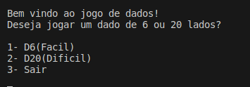

# Jogo de dados

- Um joguinho simples, apenas para passar algum tempo tentado acertar os dados
    - Contém duas dificuldades, D6 e D20
        - D6 é modo fácil, como menos possíbilidades é mais fácil de acertar.
        - D20 é modo dificil, autoexplicativo.

- Para jogar:
    - Clone a pasta do jogo.
    - Entre nela usando terminal.
    - ./build

